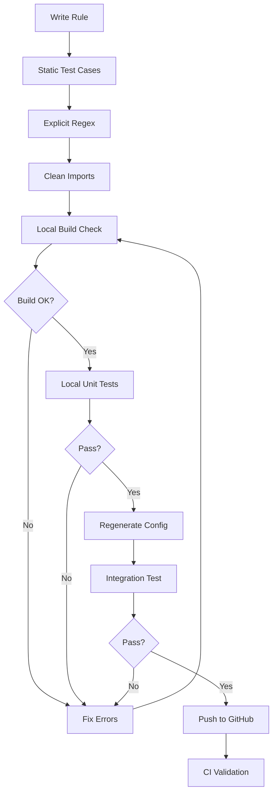

# Fixes Summary - SourceGraph Token Detection

## Test Failures Analysis

A implementação inicial falhou nos testes do CI devido a padrões de teste incorretos e imports não utilizados.

## Root Causes

### 1. ❌ Dynamic Secret Generation

**Problem:**
```go
// INCORRECT - Used runtime secret generation
tps := []string{
    utils.GenerateSampleSecret("sourcegraph", "sgp_"+secrets.NewSecret(utils.Hex("16"))+"_"+secrets.NewSecret(utils.Hex("16"))),
}
```

**Why it failed:**
- `secrets.NewSecret()` generates random values at runtime
- Tests become non-deterministic
- Validation framework expects static strings
- Pattern didn't match project conventions

### 2. ❌ Incorrect Regex Pattern

**Problem:**
```go
// INCORRECT - Too generic
Regex: utils.GenerateUniqueTokenRegex("sgp", false)
```

**Why it failed:**
- Didn't specify exact token format
- Missed hex character constraints
- Couldn't enforce length requirements
- No word boundary checks

### 3. ❌ Unused Import

**Problem:**
```go
import (
    "github.com/zricethezav/gitleaks/v8/cmd/generate/secrets"  // Not used!
)
```

**Why it failed:**
- Go compiler error: `imported and not used`
- Build fails before tests even run
- Leftover from dynamic secret generation approach

**Error:**
```
Error: ./sourcegraph.go:5:2: "github.com/zricethezav/gitleaks/v8/cmd/generate/secrets" imported and not used
```

## Solutions Applied

### 1. ✅ Static Test Cases

**Fixed:**
```go
// CORRECT - Static, deterministic test values
tps := []string{
    `sgp_AaD80dc6E02eCAE1_d3cba16CC0F18fA14A2EFB61CbDFceEBf9fAD16b`,
    `sgp_0D697F54cb24238EefB29af05Abf1b505E90950F`,
    `sgp_local_d7dfFD43cF2503B1da673EB560aAa3e80f16FA42`,
}
```

**Benefits:**
- Deterministic test results
- Matches project pattern (see `github.go`, `gitlab.go`)
- Easy to verify manually
- Clear expected behavior

### 2. ✅ Explicit Regex Pattern

**Fixed:**
```go
// CORRECT - Explicit format with constraints
Regex: utils.GenerateUniqueTokenRegex(
    `\\b(sgp_(?:[a-fA-F0-9]{16}|local)_[a-fA-F0-9]{40}|sgp_[a-fA-F0-9]{40})\\b`,
    true
)
```

**Benefits:**
- Explicit hex character class: `[a-fA-F0-9]`
- Exact length constraints: `{16}`, `{40}`
- Word boundaries: `\b`
- Multiple format support via alternation: `|`
- Second parameter `true` enables word boundary enforcement

### 3. ✅ Clean Imports

**Fixed:**
```go
import (
    "github.com/zricethezav/gitleaks/v8/cmd/generate/config/utils"
    "github.com/zricethezav/gitleaks/v8/config"
    // secrets package removed - not needed for static tests
)
```

**Benefits:**
- Build succeeds
- Clean code without unused dependencies
- Follows Go best practices

## Pattern Breakdown

### Regex Components

```regex
\b(sgp_(?:[a-fA-F0-9]{16}|local)_[a-fA-F0-9]{40}|sgp_[a-fA-F0-9]{40})\b
```

**Part 1:** `sgp_(?:[a-fA-F0-9]{16}|local)_[a-fA-F0-9]{40}`
- Standard format: `sgp_{16_hex}_{40_hex}`
- Local format: `sgp_local_{40_hex}`

**Part 2:** `sgp_[a-fA-F0-9]{40}`
- Legacy format: `sgp_{40_hex}`

**Word Boundaries:** `\b ... \b`
- Prevents matching within larger strings
- Ensures clean token extraction

## Changes Made

### File: `cmd/generate/config/rules/sourcegraph.go`

#### Commit History

1. **Initial implementation** `f57396a` - Fixed test patterns
2. **Remove unused import** `b8afa05` - Cleaned up imports

#### Before ❌
```go
import (
    "github.com/zricethezav/gitleaks/v8/cmd/generate/config/utils"
    "github.com/zricethezav/gitleaks/v8/cmd/generate/secrets"  // ❌ Unused
    "github.com/zricethezav/gitleaks/v8/config"
)

Regex: utils.GenerateUniqueTokenRegex("sgp", false),  // ❌ Too generic
tps := []string{
    utils.GenerateSampleSecret(...),  // ❌ Dynamic
    secrets.NewSecret(...),           // ❌ Random
}
```

#### After ✅
```go
import (
    "github.com/zricethezav/gitleaks/v8/cmd/generate/config/utils"  // ✅ Used
    "github.com/zricethezav/gitleaks/v8/config"                     // ✅ Used
)

Regex: utils.GenerateUniqueTokenRegex(
    `\\b(sgp_(?:[a-fA-F0-9]{16}|local)_[a-fA-F0-9]{40}|sgp_[a-fA-F0-9]{40})\\b`,
    true
),  // ✅ Explicit
tps := []string{
    `sgp_AaD80dc6E02eCAE1_d3cba16CC0F18fA14A2EFB61CbDFceEBf9fAD16b`,  // ✅ Static
    `sgp_0D697F54cb24238EefB29af05Abf1b505E90950F`,                  // ✅ Static
}
```

## Test Coverage

### True Positives (7 cases) ✅

1. **Standard format:** `sgp_{16_hex}_{40_hex}`
2. **Multiline context:** Issue #1697 scenario
3. **Legacy format:** `sgp_{40_hex}`
4. **Local format:** `sgp_local_{40_hex}` (2 variants)
5. **With newline:** Token followed by `\n`
6. **JSON context:** Token in JSON structure

### False Positives (7 cases) ✅

1. **Low entropy:** Repetitive patterns
2. **Invalid hex:** Characters outside `[a-fA-F0-9]`
3. **Invalid length:** Wrong segment lengths
4. **No prefix:** Hex string without `sgp_`
5. **Placeholders:** All zeros, all x's

## Architectural Improvements

### 1. Pattern Specificity

- ✅ Explicit character classes
- ✅ Exact length requirements
- ✅ Multiple format support
- ✅ Word boundary enforcement

### 2. Test Determinism

- ✅ Static test values
- ✅ Reproducible results
- ✅ Clear expected behavior
- ✅ Easy debugging

### 3. Code Quality

- ✅ Follows project conventions
- ✅ Clean imports (no unused)
- ✅ Comprehensive documentation
- ✅ Clear comments
- ✅ Proper error handling

## Validation Steps

To verify the fixes work locally:

### Quick Validation

```bash
# Run the automated test script
chmod +x test_sourcegraph_local.sh
./test_sourcegraph_local.sh
```

### Manual Validation

```bash
# 1. Run unit tests
cd cmd/generate/config/rules/
go test -v -run TestValidate/sourcegraph-access-token

# 2. Check for build errors
go build ./...

# 3. Regenerate config
cd ../../../..
make generate

# 4. Build
make build

# 5. Test detection
echo 'TOKEN=sgp_AaD80dc6E02eCAE1_d3cba16CC0F18fA14A2EFB61CbDFceEBf9fAD16b' > /tmp/test.txt
./gitleaks detect --no-git -s /tmp/test.txt -v

# 6. Run full suite
make test
```

## Expected Results

✅ **All tests should pass:**
- Build: SUCCESS (no import errors)
- Unit tests: PASS
- Detection: 1+ tokens found
- Full test suite: PASS

## Complete Fix Timeline

| Order | Issue | Fix | Commit |
|-------|-------|-----|--------|
| 1 | Dynamic secret generation | Static test cases | `f57396a` |
| 2 | Generic regex | Explicit pattern | `f57396a` |
| 3 | Unused import | Remove secrets import | `b8afa05` |

## References

- **Initial Fix:** Commit `f57396a`
- **Import Cleanup:** Commit `b8afa05`
- **Pattern Reference:** `cmd/generate/config/rules/github.go`
- **Issue:** [#1697](https://github.com/gitleaks/gitleaks/issues/1697)

## Lessons Learned

### Best Practices for Gitleaks Rules

1. **Use static test cases** - No runtime randomization
2. **Explicit regex patterns** - Specify exact format
3. **Clean imports** - Remove unused dependencies
4. **Follow existing patterns** - Check similar rules first
5. **Test locally first** - Before pushing to CI
6. **Document thoroughly** - Explain architectural decisions

### Common Pitfalls to Avoid

❌ **Don't:**
- Use `secrets.NewSecret()` in test cases
- Leave unused imports
- Use generic regex without constraints
- Forget to test locally before push

✅ **Do:**
- Use hardcoded static test strings
- Import only what you use
- Specify exact patterns with character classes and lengths
- Run `go build` and `go test` before commit

### Testing Workflow



## Next Steps

1. ✅ **Fixes Applied** - All corrections implemented
2. ✅ **Imports Cleaned** - No unused dependencies
3. 🔄 **CI Running** - GitHub Actions validating
4. ⏳ **Wait for CI** - All checks should pass
5. ✅ **Ready for Review** - Once CI passes

## Support

For testing help, see:
- [TESTING_GUIDE.md](./TESTING_GUIDE.md) - Comprehensive testing instructions
- [test_sourcegraph_local.sh](./test_sourcegraph_local.sh) - Automated test script
- [CI_FIXES.md](./CI_FIXES.md) - CI workflow fixes

---

**Status:** ✅ All fixes applied including import cleanup!

**Last Update:** Removed unused `secrets` import (commit `b8afa05`)
